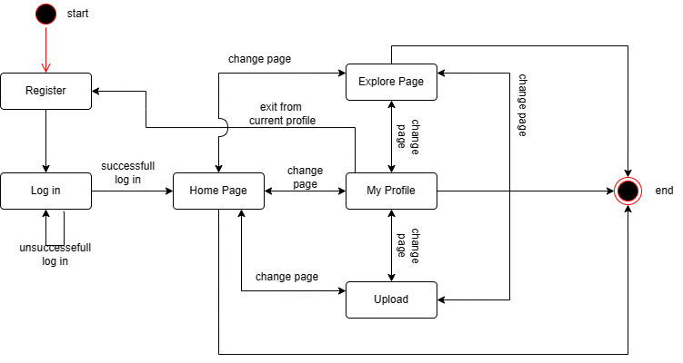
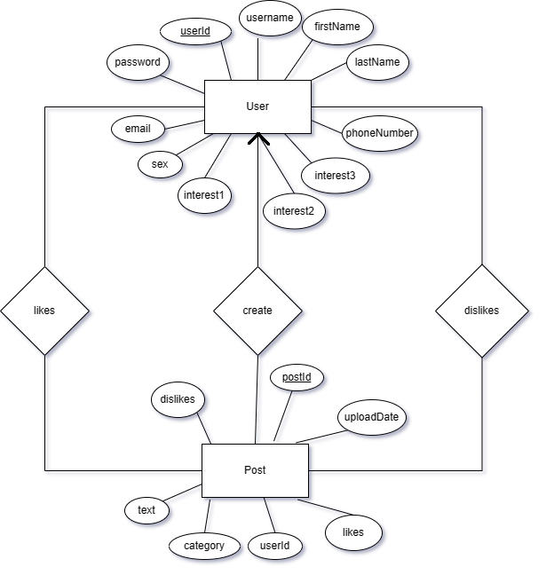

# GetTip()
## General infos 
GetTip() is a social media application for lifehacks and tips, developed for the purpose of our programming courses in the Athens University of Economics and Business, Department of Managment and Science Technology.

(https://www.youtube.com/watch?v=d76YI5TjrEg)

## Run the project
* Firstly, pull the project from our repository 
* Make sure to be in the root directory 
* To build the project run the command:
```
 mvn clean compile assembly:single
```
This will generate a jar file with all the dependencies which can be used.
* Move tipme-1.0-SNAPSHOT-jar-with-dependencies.jar to the `root` directory
* Then, type:
```
java -cp tipme-1.0-SNAPSHOT-jar-with-dependencies.jar kourpa.Main
```
* Alternatively, you can  run the `main` method in `Main.java` in your chosen IDE, e.g. `IntelliJ` .
## Instructions for usage 📒 
When you run the .jar file or main method the frame of **Register** appears. If it is the first time you open the app then you must create a new acccount, else you can can press the **Login** button to connect to your existing account. When you submit your infos, you are moving to the **HomePage** section of the App where you can see posts from other users for the interests you submitted and, as well, like them and dislike them.

 <span style="color:magenta"> *The menu in the upper body of the application can navigate you through the different functionalities.* </span>The home icon represents the homepage, the magnifying glass represents the search section and person icon is for MyProfile section. Lastly, there is a row icon for the Upload.

 In **Search**, there are many categories for tips to find, such as Nature, Sports and Science. When the user presses a category he only sees post from his choice. Next, in **MyProfile** the user can change his personal infos and the interests that were submitted in Register and can see his/her posts. Finally, in **Upload** you can publish your own tips/lifehacks, as long as it is less than 250 charachters. Generally, small posts are preferable. 
 

 ✅ **Features**: 
 1. Learning new things and lifehacks through posts 
 2. Liking and disliking things
 3. Selecting specific interests to appear in Homepage
 4. Search for a certain category in Search section
 5. Review the history of your posts


## Structure of content in the repository
* ```src folder``` has the java code of our project. It consists of 11 classes and the respective test classes.
* ```target folder``` houses all output of the build.
* ```Settings and vs.code``` contains files so that the project can be compatible with eclipse and VSC.
* ```.github/workflows``` contains the yml file that enables github actions
* ```Outside of any folder``` exists the database the pom.xml and some other files.


## UML diagram
In the next graph you can see how our classes are related through the action that happen in the app (**UML state**)



## Overview of data structures
Our team tried to utilize the capabilities of SQLite. The data are processed and stored through that.
Our database has 4 tables with a summary of 22 attributes. The entities are User, likes, dislikes and Posts.




